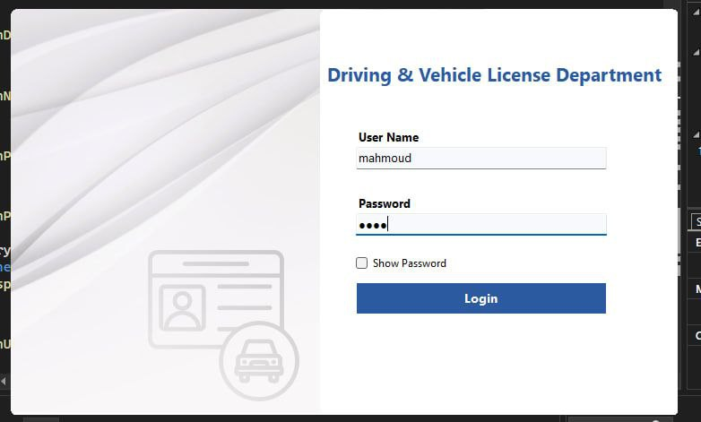
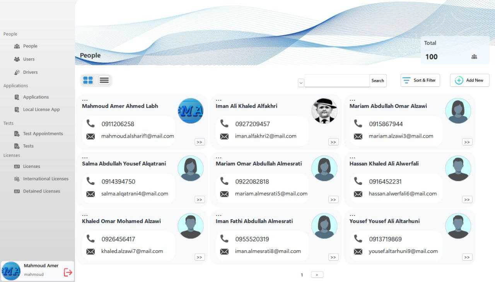
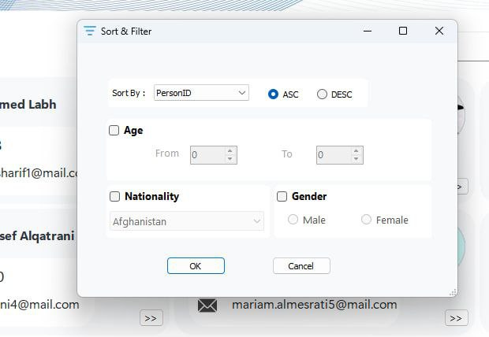
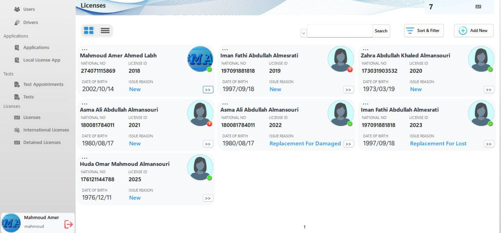
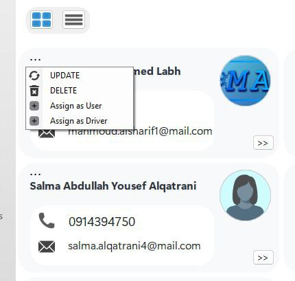
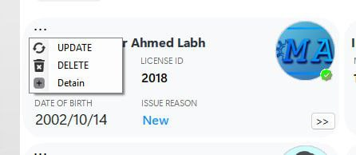

# 🚗 DVLD System (Driving & Vehicle License Department)

A desktop application that simulates 
a real-world Driving & Vehicle License Department system, 
built with a focus on clean architecture, 
modular design, and advanced UI management.

تطبيق مكتبي يحاكي نظام إدارة رخص القيادة والمركبات
، مع التركيز على بناء هيكلية قوية، 
وتنظيم الكود، وإدارة واجهة المستخدم بشكل متقدم.

---

## 🎯 Project Overview | نظرة عامة

This is an educational project designed to simulate 
a real government system used 
for managing driving licenses,
people records, and applications.

هذا المشروع هو مشروع تعليمي
يحاكي نظامًا حكوميًا حقيقيًا لإدارة:

* الأشخاص
* الرخص
* الطلبات
* الاختبارات 
  

---

## 🧩 Key Features | المميزات

* 🔹 Dynamic UI Navigation System
  نظام تنقل ديناميكي داخل الواجهة

* 🔹 Advanced Filtering & Data Display
  نظام متقدم للفلترة وعرض البيانات

* 🔹 Role-Based Permission System
  نظام صلاحيات مبني على العمليات (إضافة، تعديل، حذف...)

* 🔹 Modular Architecture (Separation of Concerns)
  تطبيق مبدأ "فرق تسد" لتنظيم المشروع

* 🔹 Real-world DVLD Simulation
  محاكاة واقعية لنظام إدارة الرخص

---

## 🔐 Permission System | نظام الصلاحيات

The system includes a flexible permission
system where access is controlled 
per module:

النظام يحتوي على نظام صلاحيات مرن
يتم فيه التحكم في العمليات حسب نوع البيانات:

* 👤 People Management (إدارة الأشخاص)
* 🚘 Licenses (الرخص)
* 📄 Applications (الطلبات)
* 📢 Other... 

Each module has its own permissions such as:

* Add (إضافة)
* Update (تعديل)
* Delete (حذف)

---

## 🛠️ Technologies Used | التقنيات المستخدمة

* C# (WinForms)
* ADO.NET
* SQL Server
* Layered Architecture

---

## 🗂️ Database | قاعدة البيانات

The system uses a SQL Server database
consisting of 14 tables designed 
to simulate a real-world system.

يستخدم المشروع قاعدة بيانات SQL Server
تحتوي على 14 جدول تم تصميمها لمحاكاة نظام حقيقي.

---

## 🖼️ Screenshots | صور من البرنامج

### 🔐 Login Screen

### 👤 People Management

### 🔍 People Filter

### 🚘 Licenses

### 📋 Context Menu - People

### 📋 Context Menu - Licenses

---

## 🚀 How to Run | طريقة التشغيل

1. Open the solution using Visual Studio
2. Restore the SQL Server database
3. Update the connection string
4. Run the project

---

## 💡 Why This Project is Special | لماذا هذا المشروع مميز

This project focuses on software architecture and clean design rather than just basic CRUD operations.

يركز هذا المشروع على:

* تصميم الأنظمة (Architecture)
* تنظيم الكود
* فصل المسؤوليات (Separation of Concerns)

وليس فقط على العمليات التقليدية (CRUD)

---

## 👨‍💻 Developer | المطور

Developed by: **Mahmoud Amer**

---

## 📌 Notes | ملاحظات

This project is for educational purposes only.

هذا المشروع لأغراض تعليمية فقط.

---
